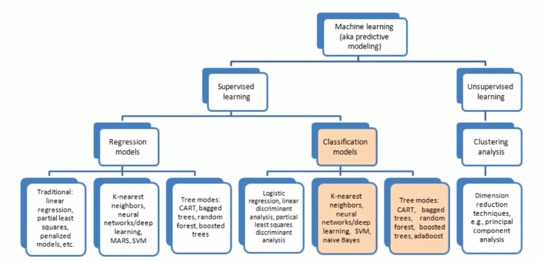

## My Machine Learning Toolkit

This repository contains various hands-on examples and notes around the development and implementations of various machine learning techniques and architectures.

>Source: Deutsche Bank Quantitative Strategy 

##### Hands-on examples & Markdown Notes

--- 
_Training Machine Learning Algorithms for Classification_
- [Perceptron](src/perceptron.ipynb) - Step by step implementation in Python 
- [Adaline](src/adaline.ipynb) - Working with the basics of optimizations, stochastic/batch gradient descent

---

_Machine Learning Classifiers Using Scikit-learn_ 
- [Perceptron with sklearn](src/perceptron-sklearn.ipynb) - Demonstrating the iris dataset with perceptron algorithm in sklearn ml kit
- [Logistic Regression with sklearn](src/logisticregression-sklearn.ipynb) - Working with logistic regression in sklearn & visualizing regularization
- [Support Vector Machines (SVM) with sklearn](src/supportvectormachines.ipynb) - Using the linear and kernal SVM,
- [Decision tree learning, Random Forest](src/decisiontree.ipynb) - Impurity measures, such as Gini, Entropy & Classification Error
- [K-nearest neighbors classifier (KNN)](src/knearestneighbors.ipynb) - Visualizing the lazy learning algorithm

---

_Building good datasets_
- [Data Preprocessing 1](src/datapreprocessing-part1.ipynb) - Handling missing, nominal and ordinal values
- [Data Preprocessing 2](src/datapreprocessing-part2.ipynb) - Dataset partitioning, feature scaling & selecting
- [Data Preprocessing 3](src/datapreprocessing-part3.ipynb) - Sequential feature selection (SBS), Feature importance with Random Forests  

---

_Compressing Data via Dimensionality Reduction_
- [Principal component anaysis (PCA)](src/pca.ipynb) - Building pca, and using pca in sklearn
- [Linear discriminant analysis](src/lda.ipynb) (Coming soon)

---

### Readings
- [Python Machine Learning, Sebastian Raschka](https://www.amazon.com/Python-Machine-Learning-Sebastian-Raschka-ebook/dp/B00YSILNL0#navbar)

### Other Notes

- [Machine Learning, Stanford University (Andrew Ng) - Using octave](https://github.com/jaysonfrancis/coursera/tree/master/machinelearning-stanford)